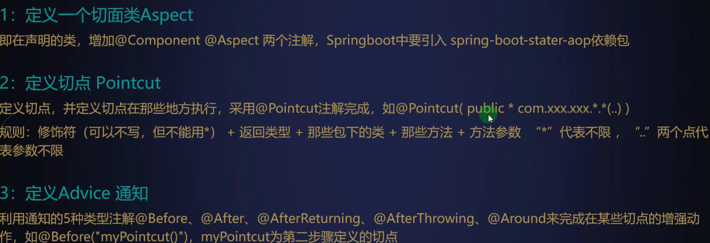

## spring-aop

###AOP的两种代理方式

>Spring提供了两种方式来生成代理对象：JDK Proxy和CGLIB。具体使用哪种方式AopProxyFactory根据AdvicedSupport对象的配置来决定。一般情况下，如果目标类是接口，使用JDK动态代理，否则使用CGLIB来生成代理。

###JDK动态接口代理

>Java动态代理主要涉及到java.lang.reflect包下的两个类:Proxy和invocationHandler .InvocationHandler是一个接口,通过实现该接口定义横切逻辑,并通过反射机制调用目标类的代码,动态将横切逻辑和业务逻辑编织在一起.Proxy利用invocationHandler动态创建一个符合某一接口的实例,生成目标类的代理对象.

###CGLIB动态代理

>CGLIB是一个强大的高性能\高质量的代码生成类库,可以在运行期扩展Java类与实现Java接口,CGLIB封装了asm，可以在运行期动态生成新的class，和JDK动态代理相比较，JDK创建代理只能为接口创建实例，而对于没有通过接口定义业务方法的类，则可以通过CGLIB创建动态代理。

###应用场景
* 权限校验
> 上清前置，根据证书编号+操作员号验证权限
* 事务管理
> 系统事务管理
* 内容分发
> 指令同步外部系统
* 日志记录
> 指令流转监控

### 基本术语
>
### 使用
>

lock 与 synchronized区别
>